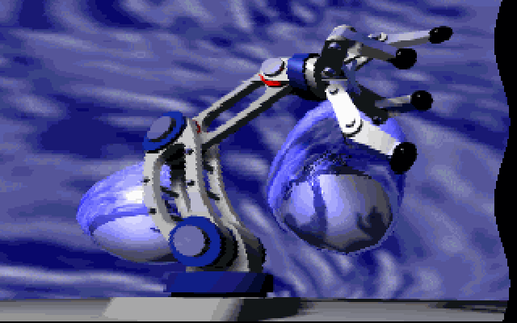
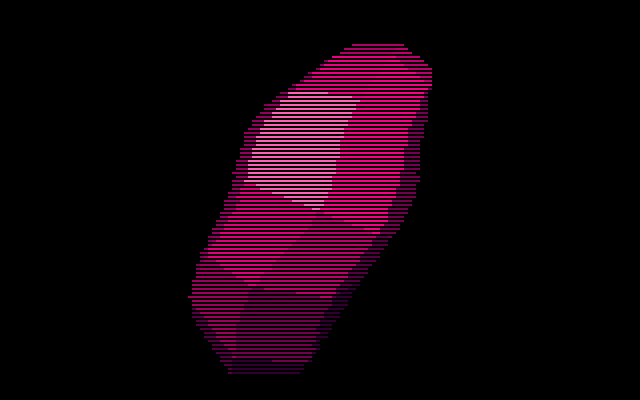
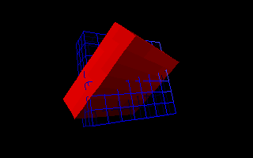
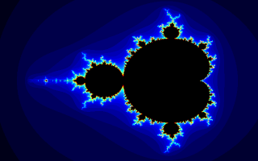
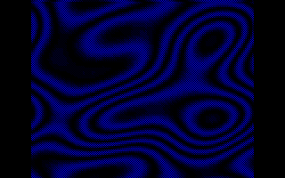
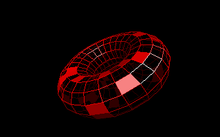

# GFX-13


> *Version 1.1 (x86 Assembly)*

<p align="center">
  &emsp;
  &emsp;
  
</p>

<p align="center">
  &emsp;
  &emsp;
  
</p>
<p align="center">
  &emsp;
  &emsp;
  
</p>
<p align="center"><em>3D codded with my <a href="https://github.com/rohingosling/M3DE">M3DE</a> graphics engine.</em></p>

<br>

A VGA Mode 13h (320x200, 256 colors) 2D graphics library for demo coding, written in x86 assembly language back in the 90s.

## 📑 Table of Contents

- [🏷️ Version](#-version)
- [✨ Features](#-features)
- [🧩 API](#-api)
- [🚀 Usage](#-usage)
- [🔨 Build](#-build)
- [🧪 Test Suite](#-test-suite)
- [📁 Repository Structure](#-repository-structure)
- [⚙️ Technical Details](#-technical-details)
- [📄 License](#-license)

## 🏷️ Version

| Version | Language | Toolchain |
|---------|----------|-----------|
| [v1.1](https://github.com/rohingosling/GFX13-v1-ASM) | Pure 80x86 assembly | TASM (For GFX-13 library)<br>Borland Turbo C++ 3.1 (For test programs) |
| [v2.1](https://github.com/rohingosling/GFX13-v2-C) | Upgraded version written in C with inline assembly | Borland Turbo C++ 3.1 |

## ✨ Features

- Fast clipping
- Putting and getting pixels.
- Wireframe primitives.
- Filled primitives.
- Image blitting (Get image and scale image added to version 2.0)

## 🧩 API

```c
// Mode Functions

void SetMode13      ( void );
void SetTextMode    ( BYTE rows );
BYTE GetTextMode    ( void );

// Palette and Clipping Functions

void SetPalette     ( BYTE col, WORD count, WORD segment, WORD dataOffset );
void SetClipping    ( int x0,  int y0,  int x1,  int y1 );

// Screen Functions

void ClearScreen    ( BYTE col, WORD dest );
void FlipScreen     ( WORD source, WORD dest );
void WaitRetrace    ( void );

// Pixel Functions

void PutPixel       ( WORD x,  WORD y,  BYTE col, BYTE clip, WORD dest );
BYTE GetPixel       ( WORD x,  WORD y,  BYTE clip, WORD source );

// Unfilled Primitives

void Line           ( WORD x0, WORD y0, WORD x1, WORD y1, BYTE col, BYTE clip, WORD dest );
void Triangle       ( WORD x0, WORD y0, WORD x1, WORD y1, WORD x2, WORD y2, BYTE col, WORD dest );
void Rectangle      ( WORD x0, WORD y0, WORD x1, WORD y1, BYTE col, WORD dest );
void Quad           ( WORD x0, WORD y0, WORD x1, WORD y1, WORD x2,  WORD y2, WORD x3, WORD y3, BYTE col, WORD dest );

// Filled Primitives

void FillRectangle  ( WORD x0, WORD y0, WORD x1, WORD y1, BYTE col, WORD dest );
void FillTriangle   ( int x0, int y0, int x1, int y1, int x2, int y2, BYTE col, WORD dest );
void FillQuad       ( int x0, int y0, int x1, int y1, int x2, int y2, int x3, int y3, BYTE col, WORD dest );

// Blitting Functions

void PutImage       ( WORD x, WORD y, WORD xs, WORD size, BYTE mask, WORD source_seg, WORD source_offs, WORD dest );

```

All `dest` and `source` parameters are 16-bit segment addresses (e.g., `0xA000` for VGA video memory).

## 🚀 Usage

```c
#include "gfx13.h"

#define VGA 0xA000

int main ( void )
{
    // Set mode-13h.

    SetMode13 ();

    // GFX-13 function calls.

    ClearScreen  ( 0, VGA );
    FillTriangle ( 160, 10,  10,  190, 310, 190, 4, VGA ) ;
    Line         ( 0,   0,   319, 199, 15,  1,      VGA );
    PutPixel     ( 160, 100, 14,  1,                VGA);

    // Return to text mode.

    getch       ();
    SetTextMode ( 25 );

    // Exit program.

    return 0;
}
```

## 🔨 Build

Requires [DOSBox](https://www.dosbox.com/) (or real DOS) with Borland Turbo Assembler (TASM) 3.x and Borland Turbo C++ 3.1 on PATH.

### Assembly + Test Programs

```bat
cd test
build.bat
```

Assembles `gfx13.asm` with TASM (`/ml` for case-sensitive C linkage), then compiles and links 8 test programs with BCC.

### Run

After building, run any test program by executing its `.exe` from the `test/` directory under DOSBox (or real DOS), e.g. `testpix.exe`.

### Clean

Run `clean.bat` from the `test/` directory to remove build artifacts.

## 🧪 Test Suite

The library includes 8 visual test programs:

| Test | Description |
|------|-------------|
| `testpix`  | Pixel drawing, reading, and screen clearing |
| `testline` | Line drawing with Bresenham's algorithm |
| `testrect` | Outline and filled rectangles |
| `testtri`  | Outline and filled triangles |
| `testquad` | Outline and filled quadrilaterals |
| `testimg`  | Image blitting with `PutImage` |
| `testpal`  | VGA palette manipulation |
| `testclip` | Clipping rectangle tests |

Each test program displays multiple screens. Press any key to advance between screens.

## 📁 Repository Structure

```
GFX13-v1-ASM/
├── src/                Library source
│   ├── gfx13.asm       Library source (pure TASM assembly)
│   └── gfx13.h         C-callable header (18 functions)
├── images/             Screenshot captures
│   └── capture/        Demo and test screenshots
└── test/               8 visual test programs
    ├── build.bat       Build script (TASM + BCC)
    ├── clean.bat       Clean build artifacts
    ├── testutil.h      Shared test utilities
    ├── testpix.c       Pixel drawing and reading
    ├── testline.c      Line drawing
    ├── testrect.c      Outline and filled rectangles
    ├── testtri.c       Outline and filled triangles
    ├── testquad.c      Outline and filled quads
    ├── testimg.c       Image blitting
    ├── testpal.c       VGA palette manipulation
    └── testclip.c      Clipping rectangle tests
```

## ⚙️ Technical Details

- **Target:** 80186+ real mode, small memory model
- **Resolution:** 320x200, 256 colors (VGA Mode 13h)
- **Pixel offset:** `y * 320 + x` computed via shifts as `y*256 + y*64 + x`
- **Line clipping:** Cohen-Sutherland algorithm
- **Filled polygons:** Scanline rasterization with 16.16 fixed-point DDA edge walking
- **Palette streaming:** `REP OUTSB` to VGA DAC (requires 80186+)

## 📄 License

This project is released under the [MIT License](LICENSE) — Copyright © 1991 Rohin Gosling.
